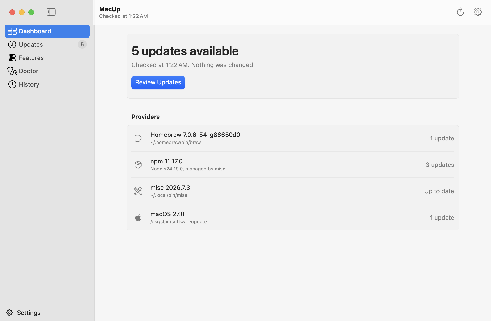
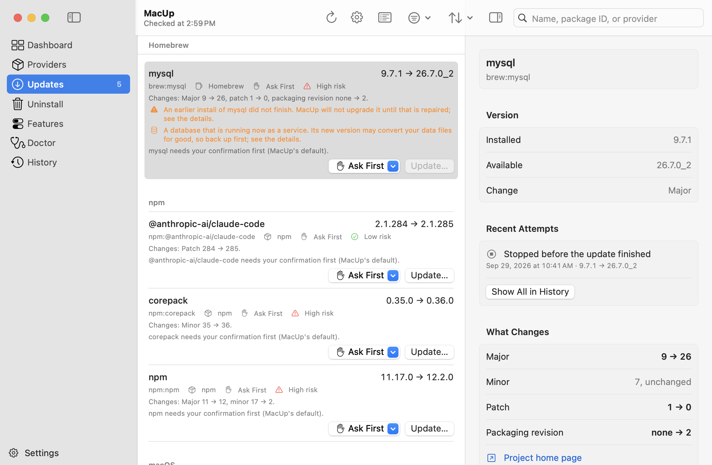
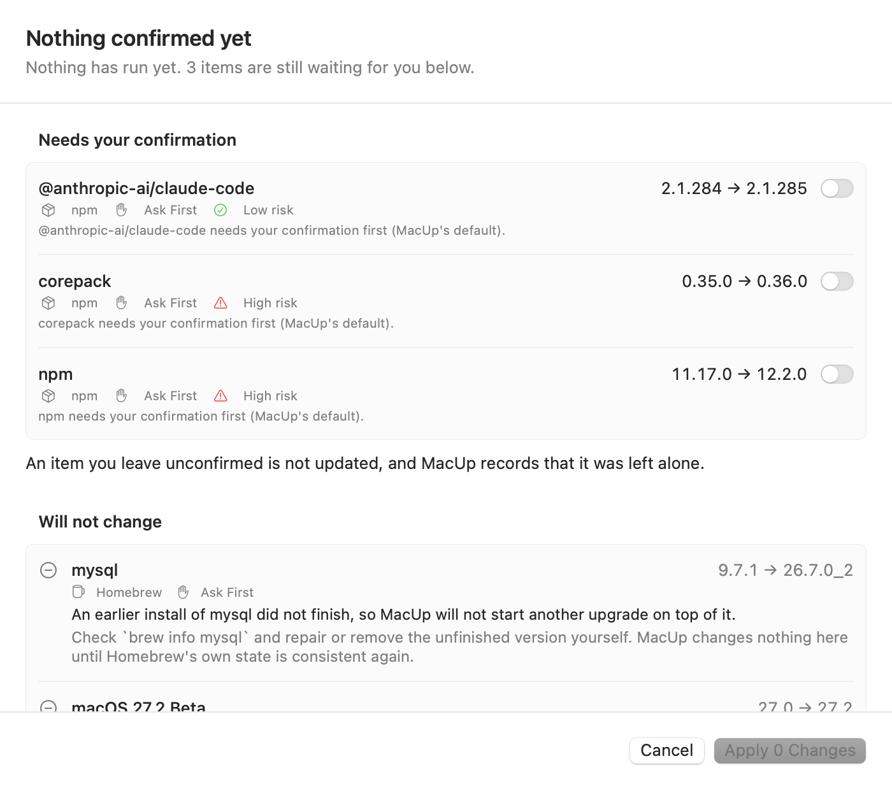
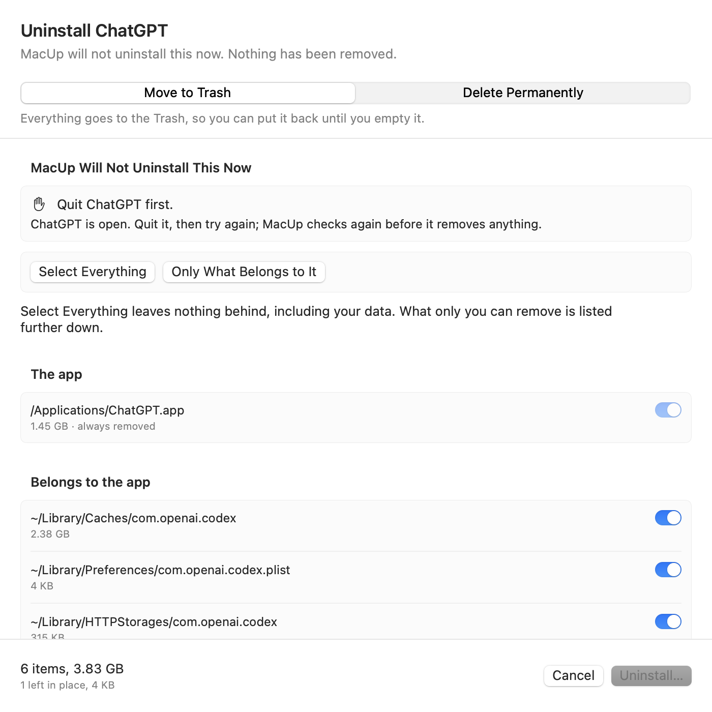
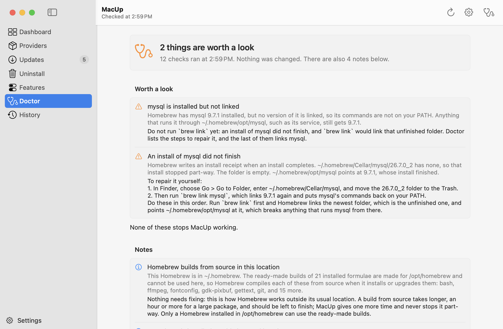
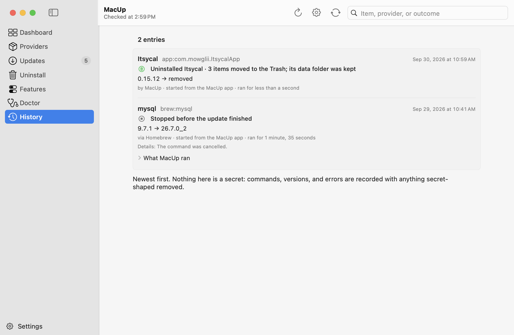

<div align="center">


# MacUp

**One place to understand, update, and maintain your Mac development environment.**

Homebrew, npm, mise, and macOS updates in one native app and one command-line tool,
with the exact command shown before anything runs.

[](https://github.com/sd2389/macup/actions/workflows/ci.yml)
[](https://github.com/sd2389/macup/releases)
[](LICENSE)
[](#install)
[](Package.swift)

[Install](#install) · [Features](#features) · [Command line](#command-line) · [Why trust it](#built-to-be-trusted) · [Docs](#documentation)

<br>

<picture>
  <source media="(prefers-color-scheme: dark)" srcset="site/screenshots/dashboard-dark.png">
  
</picture>

</div>

## Why MacUp

A developer's Mac is kept up to date by half a dozen tools that don't know about
each other. `brew upgrade` upgrades everything at once. A global npm package is
tied to whichever Node is active. A runtime bump can quietly rewrite a project's
config. MacUp doesn't replace any of these tools. It sits on top of the ones you
already have and gives you one careful place to manage them:

- **See everything in one check.** Homebrew formulae and casks, global npm
  packages, mise runtimes, and macOS software updates. For each item it shows
  who manages it, what changes, and how risky the change is.
- **Change only what you approve.** Every update starts as a plan showing the
  exact executable and arguments. Nothing runs until you confirm it, and your
  rules are read again right before each command.
- **Uninstall without leftovers.** Remove apps and packages along with the
  files they leave in `~/Library`. Items go to the Trash by default, and your
  data stays unticked unless you tick it. What an installer put in place as
  root — helpers, system launchd jobs, receipts — MacUp writes down as a
  script you read and run with `sudo`, because MacUp never becomes an
  administrator itself.
- **Stay local.** No account, no cloud, no telemetry, and no background daemon.
  MacUp never runs as root and never asks for your password.

## Features

<table>
  <tr>
    <td width="50%" valign="top">
      <h3>Review every update</h3>
      Updates are grouped by provider, with current → available versions, a risk
      level with its reasons, and the rule that decides each one. You can search,
      filter, sort, skip a version, or add a note.
    </td>
    <td width="50%" valign="top">
      <h3>Approve before anything runs</h3>
      A review sheet lists what will change, what needs your confirmation, and
      what will be left alone and why. The exact commands are one click away.
    </td>
  </tr>
  <tr>
    <td>
      <picture>
        <source media="(prefers-color-scheme: dark)" srcset="site/screenshots/updates-dark.png">
        
      </picture>
    </td>
    <td>
      <picture>
        <source media="(prefers-color-scheme: dark)" srcset="site/screenshots/review-dark.png">
        
      </picture>
    </td>
  </tr>
  <tr>
    <td width="50%" valign="top">
      <h3>Uninstall cleanly</h3>
      Apps, Homebrew formulae and casks, npm packages, and mise runtimes, plus
      their caches, preferences, and launch agents. You choose between the Trash
      and permanent deletion every time, and nothing you leave unticked is touched.
    </td>
    <td width="50%" valign="top">
      <h3>Doctor explains your setup</h3>
      Deterministic checks for the things that make a Mac behave oddly:
      duplicate Homebrew installs, <code>PATH</code> differences between the app
      and your shell, npm tied to a mise-managed Node, and unfinished installs.
      Each finding comes with safe steps you can follow yourself.
    </td>
  </tr>
  <tr>
    <td>
      <picture>
        <source media="(prefers-color-scheme: dark)" srcset="site/screenshots/uninstall-review-dark.png">
        
      </picture>
    </td>
    <td>
      <picture>
        <source media="(prefers-color-scheme: dark)" srcset="site/screenshots/doctor-dark.png">
        
      </picture>
    </td>
  </tr>
</table>

**Also included:**

- **History of every attempt.** Each entry has a one-line headline, the
  versions before, targeted, and after, the command that ran, and why anything
  was skipped.
- **Policies** per item, per provider, and globally: Auto Update, Ask First,
  Ignore, and Pin.
- **Scheduled checks** through a launchd user agent. They only read, unless
  you also switch on installing the items you set to Auto Update — and then
  nothing else is installed. One switch removes the schedule either way.
- **Menu bar** list of pending updates.
- **Touch ID confirmation** before MacUp changes anything, if you want it.
- **Export Diagnostics:** a redacted file for bug reports, with package names
  replaced by placeholders.
- **Both surfaces, one engine.** Every feature works the same in the app and in
  `macup`, because both are built on the same `MacUpCore`.

<p align="center">
  <picture>
    <source media="(prefers-color-scheme: dark)" srcset="site/screenshots/history-dark.png">
    
  </picture>
</p>

## Install

MacUp needs **macOS 14 Sonoma or later** and runs on Apple silicon and Intel Macs.

### The app

1. Download `MacUp-<version>-macos-universal.zip` from the
   [latest release](https://github.com/sd2389/macup/releases), unzip it, and
   move **MacUp** to Applications.
2. Open it. This build isn't notarized yet, because the project doesn't have
   an Apple Developer ID, so macOS blocks it the first time. Open
   **System Settings → Privacy & Security**, find the message about MacUp, and
   click **Open Anyway**. You only need to do this once.

To confirm the download is intact, check it against `SHA256SUMS` from the same
release:

```bash
shasum -a 256 -c SHA256SUMS --ignore-missing
```

The app includes the command-line tool at `MacUp.app/Contents/Helpers/macup`.

### The command-line tool

With Homebrew (this builds from source and needs the Xcode Command Line Tools):

```bash
brew install sd2389/macup/macup
```

Or download `macup-<version>-macos-universal.tar.gz` from the release and put
`macup` somewhere on your `PATH`. It is the same binary the app bundle
carries, with the same signature, so it is not notarized yet either: the first
time you run a downloaded copy, macOS asks, and **System Settings → Privacy &
Security → Open Anyway** allows it once.

### From source

```bash
git clone https://github.com/sd2389/macup.git
cd macup
make install   # puts the command-line tool in ~/.local/bin
make app       # builds build/MacUp.app
```

This needs Swift 6 (Xcode 16 or later, or its Command Line Tools). To remove
MacUp later, run `macup self-uninstall`, use **Settings → Uninstall MacUp**, or
run `make uninstall` or `brew uninstall macup`.

## Command line

`macup` on its own is a read-only check. Only `macup update` and
`macup uninstall` change what's installed, and both show their plan and ask
first.

```bash
macup                        # what's outdated (reads only, changes nothing)
macup plan                   # every update MacUp would make, with the exact commands
macup update --dry-run       # the same, and it launches nothing
macup update brew:git        # update one named item
macup explain brew:git       # everything MacUp knows about one item
macup policy set brew:postgresql ignore   # never touch this one
macup uninstall ChatGPT --dry-run         # what uninstalling an app would remove
macup doctor                 # what's odd about this Mac
macup history                # what MacUp did, and what it decided not to do
```

Add `--json` for scripts. The output schemas are versioned, and there's no ANSI
color when the output isn't a terminal. Example output (illustrative):

```text
MacUp check · read-only · nothing was changed

Homebrew 4.5.0 · /opt/homebrew/bin/brew
  142 installed · 2 updates
  brew:git    2.49.0 → 2.50.0    minor · moderate risk
  brew:mysql  9.3.0 → 9.4.0      minor · moderate risk

npm 11.4.2 · ~/.local/share/mise/installs/node/24.3.0/bin/npm
  Node v24.3.0 · managed by mise
  3 installed · 1 update
  npm:@anthropic-ai/claude-code  2.1.282 → 2.1.283  patch · low risk

mise 2026.7.3 · ~/.local/bin/mise
  2 installed · up to date

macOS 15.5 · /usr/sbin/softwareupdate
  macos:macOS Sequoia 15.6-24G84  15.5 → 15.6  minor · high risk · restart required

4 updates available (Homebrew 2, npm 1, macOS 1).
Nothing was changed.
```

[docs/CLI.md](docs/CLI.md) covers every command, flag, exit code, and JSON
schema.

### Deciding what MacUp may touch

MacUp looks for a rule on the item first, then on its provider, then uses your
global default:

| Policy | Meaning |
| --- | --- |
| `ask` | **Ask First.** The default: MacUp proposes the update, you confirm it |
| `auto` | Update without asking, unless the risk says otherwise (below) |
| `ignore` | Never update this, and never offer to |
| `pin` | Hold at the current version |
| `inherit` | Use the provider's rule, or the global default |

`auto` means "update this without asking me", not "decide anything for me".
An `auto` item still waits for you when:

- it's a macOS update or a major runtime change
- it might need an administrator or a restart
- it would rewrite a config file
- MacUp couldn't judge the risk

Every decision comes with a sentence naming the rule that produced it.

## Built to be trusted

MacUp is **conservative with changes and aggressive with information**. When it
can't be sure, it skips the item and tells you why. It never guesses. Each rule
below is enforced in code and covered by tests, not just promised:

- **It runs only the commands it showed you.** During an update, every command
  is checked against the plan you reviewed. Anything else is refused before it
  reaches the operating system.
- **Every command names one item.** There's no blanket `brew upgrade`, so an
  exclusion can't be walked past.
- **Your rules are read again right before each command.** An exclusion added
  after you opened the review still wins. If MacUp can't read its
  configuration, it changes nothing.
- **No shell.** Programs run with an executable path and an argument array, so
  a hostile package name is just an inert argument.
- **No root and no passwords.** MacUp never uses `sudo` and never captures an
  administrator password. When a step needs one, MacUp writes it down — the
  exact commands, in a file you read first — and you run that file with
  `sudo`, which asks you rather than MacUp. The app can copy the command and
  open Terminal; it cannot run it.
- **Nothing deletes on its own.** There's no automatic `brew cleanup`, and no
  pruning. Uninstalling only happens when you ask, from a reviewed plan.
- **Private by design.** MacUp makes no network requests of its own, collects
  no telemetry, and keeps your inventory on your Mac. A build check fails if
  network code appears.
- **Tests never touch your Mac.** More than 1,150 tests run against recorded
  provider output and a pretend Mac in a temporary folder.

The threat model and the code that enforces each rule are in
[docs/TRUST_AND_SECURITY.md](docs/TRUST_AND_SECURITY.md). To report a
vulnerability, use private reporting as described in [SECURITY.md](SECURITY.md).

## What MacUp doesn't do (yet)

- **Install macOS updates.** MacUp reports them. Installing one needs an
  administrator and usually a restart.
- **Roll back.** No provider action has a tested rollback, so every plan says
  rollback is unavailable instead of promising one.
- **Update anything you did not mark `auto` on a schedule.** A scheduled run
  installs only Auto Update items. Ask First items wait for you, and a plan
  needing a password or a restart is refused rather than attempted.
- **Ship notarized builds.** That's waiting on an Apple Developer ID.

## Documentation

| Document | What it covers |
| --- | --- |
| [TRUST_AND_SECURITY.md](docs/TRUST_AND_SECURITY.md) | What must be true before MacUp changes anything, and the threat model |
| [ARCHITECTURE.md](docs/ARCHITECTURE.md) | The update pipeline, from candidate to verification and history |
| [CLI.md](docs/CLI.md) | Every command, exit code, and JSON schema |
| [CONFIGURATION.md](docs/CONFIGURATION.md) | The config file, validation, and policy editing |
| [PROVIDER_NOTES.md](docs/PROVIDER_NOTES.md) | Exactly what each provider runs, plans, and verifies |
| [DEVELOPMENT.md](docs/DEVELOPMENT.md) | Building and testing |
| [ROADMAP.md](docs/ROADMAP.md) | What's done and what's next |
| [DECISIONS.md](docs/DECISIONS.md) | Architecture decision records |

[CLAUDE.md](CLAUDE.md) is the project's authoritative build brief, and
`site/` holds the landing page.

## Contributing

Issues and pull requests are welcome. See [CONTRIBUTING.md](CONTRIBUTING.md) and
the [Code of Conduct](CODE_OF_CONDUCT.md). Provider parsers are tested against
recorded output, so a bug report with the output of the command that confused
MacUp (`macup diagnostics` makes a redacted one) is the most useful kind.

## License

Apache-2.0. See [LICENSE](LICENSE).
